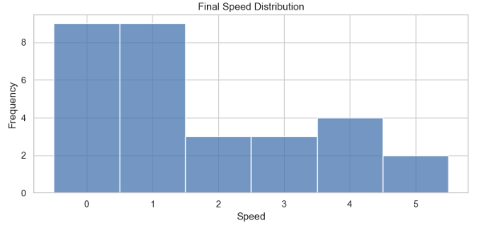

#  Traffic Congestion Simulation & Complexity Analysis


##  Overview

This project simulates traffic congestion using the **Nagel-Schreckenberg Cellular Automaton**—a simple yet powerful rule-based model for vehicle movement. The simulation captures how individual car behavior leads to **emergent traffic patterns** such as jams and stop-and-go waves.

Using Python, the simulation measures system complexity through:
- **Shannon entropy** of speed distributions
- **Gap sizes** between cars
- **Frequency of cars stuck in congestion**

An interactive animation visualizes traffic flow and jam formation in real time.

---

##  Key Metrics

| Metric                  | Value              |
|-------------------------|--------------------|
| **Average Entropy**     | 2.120 bits         |
| **Average Stuck Cars**  | 11.14 out of 30    |
| **Road Length**         | 100 cells          |
| **Simulation Steps**    | 100                |

---

##  Visualizations

###  Stuck Cars Over Time


###  Entropy Over Time


###  Final Speed Distribution


###  Gap Size Distribution


---

##  Features

- Realistic traffic flow behavior through rule-based modeling
- Animation of traffic evolution over time
- Complexity measurement using entropy
- Customizable parameters (max speed, random braking, number of cars)

---

##  Technologies Used

- Python 3
- NumPy – for numeric computation
- Matplotlib – for visualizations & animation
- Seaborn – for statistical plots
- Jupyter Notebook – interactive development

---

##  How to Run

Clone this repository:

```bash
git clone https://github.com/yourusername/TrafficCongestionSimulation.git
cd TrafficCongestionSimulation
